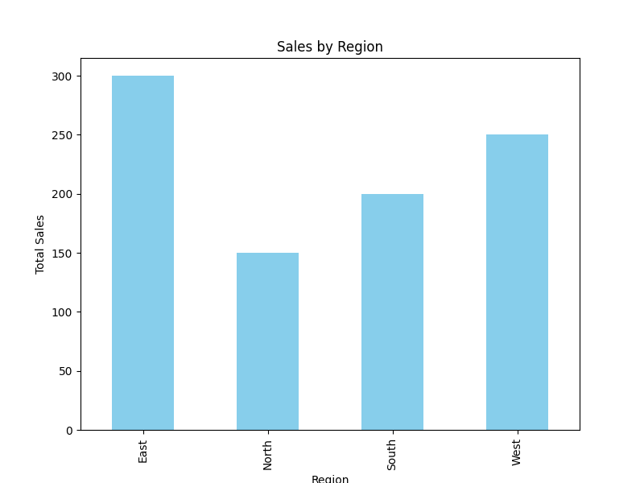

# Sales Analysis Project  

  

This project is a basic sales analysis application written in Python using `pandas` and `matplotlib`. The goal is to analyze sales data, calculate key metrics, and visualize the data.

## Project Overview

The script reads a CSV file containing sales data, performs some basic analysis (total sales, average sales, standard deviation), and generates a bar chart showing sales by region.

### Features
- **Total Sales Calculation**: Sums up the total sales across all regions.
- **Average Sales**: Calculates the average sales value.
- **Sales by Region**: Groups data by region and sums up sales per region.
- **Bar Chart**: Displays sales by region visually.
- **Metrics Export**: Saves key metrics to a CSV file (`sales_metrics.csv`).
- **Bar Chart Image**: Saves the bar chart as a PNG image (`sales_by_region.png`).

## Visualization  
Here’s the bar chart showing sales by region:  


## Getting Started

1. **Clone or download** this repository.
2. **Install dependencies**:
    ```bash
    pip install -r requirements.txt
    ```
3. **Run the script**:
    ```bash
    python main.py
    ```

The script will output:
- A bar chart image `sales_by_region.png`.
- A CSV file `sales_metrics.csv` containing the total sales, average sales, and standard deviation.

## Technologies Used

- **Python**: The programming language used to write the script.
- **Pandas**: For data manipulation and analysis.
- **Matplotlib**: For creating visualizations (bar chart).

## Project Files
- `data.csv`: The input data containing sales per region.
- `main.py`: The Python script containing the analysis logic.
- `sales_by_region.png`: The output bar chart image.
- `sales_metrics.csv`: The output CSV file with calculated metrics.

## License

This project is licensed under the MIT License. See the [LICENSE](LICENSE) file for details.
